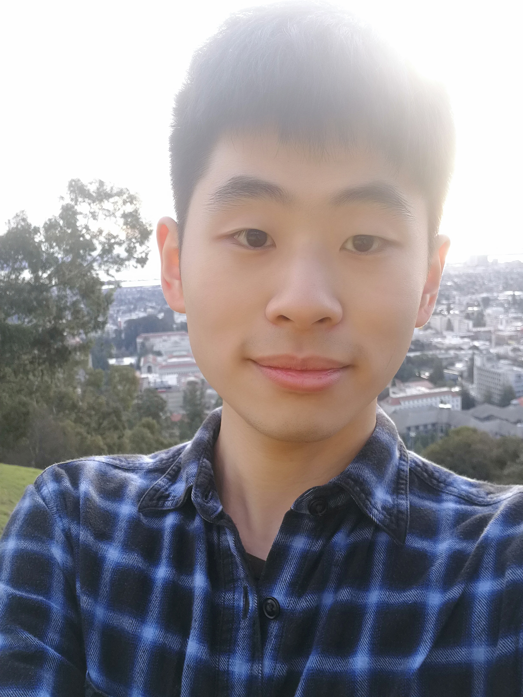

## Welcome to Lixing He's Homepage
<table border="0">
  <tr>
    <td width="75%">
      <h1>Lixing He(何力行)</h1>
      <p><b>undergraduate</b></p>
      <p><b>Automation college of UESTC(University of electronic of science and technology of China, Chengdu)</b></p>
      <p><b>helixing99@gmail.com</b></p>
      <p><b>Xiyuan ave 2006, Chengdu</b></p>
      <p><b>GPA: 90/100, Rank: 9/315</b></p>
      <p><b>Toefl: 98, GRE: 328</b></p>
    </td>
    <td width="40%">
           
    </td>
  </tr>
</table>
## Introduction
Hello, my name is Lixing He, an undergraduate student from UESTC in China.
My major is automation and now study in UC Berkeley as visiting student.
Prof. Shijia Pan from UC Merced is my advisor now.
## Research interest
My previous research project includes circuit design and signal processing, as well as optimization model. I am particularly interested in the Cyber-physical world, where I can apply my model in real-world.
## Experience
1. Visit student of National University of Singapore(Singapore), 2018
2. Campus electronic design contest(Chengdu, China) 2018
3. Earth information detection lab, signal processing in well digging(Chengdu, China), 2018, 2019
4. Undergraduate internship of China Academy Of Engineering Physic(Beijing, China), 2019
5. National mathematics modelling contest(Chengdu, China), 2019
6. Visiting Student of UC Berkeley(Berkeley, US), 2020
7. Internship student of UC Merced(Merced, US), 2020

## Award
1. Great student scholarship of China, 2018, 2019
2. Shiqiang company scholarship, 2019
3. Liren scholarship, 2018

## Activities
1. Volunteer teacher in Dazhou, 2018
2. Student assistant of human resource department, 2018
3. Recruitment head of UESTC in Jiangxi province, 2018
## Life
I am extremely interested in technology, politics(military) and chinese culture. Specially, I can read ancient chinese characters faster than modern chinese, feel energetic to think about politics and explore new knowledge of technology.

## Skills
1. Language: Mandarin(Native), English(Professional), C, Python, Matlab.
2. Sports: Badminton, Tennis.


**Bold** and _Italic_ and `Code` text

[Link](url) and 
```

For more details see [GitHub Flavored Markdown](https://guides.github.com/features/mastering-markdown/).

### Jekyll Themes

Your Pages site will use the layout and styles from the Jekyll theme you have selected in your [repository settings](https://github.com/lixinghe1999/lixinghe.github.io/settings). The name of this theme is saved in the Jekyll `_config.yml` configuration file.

### Support or Contact

Having trouble with Pages? Check out our [documentation](https://help.github.com/categories/github-pages-basics/) or [contact support](https://github.com/contact) and we’ll help you sort it out.
