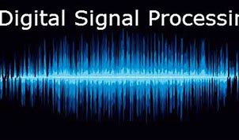
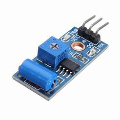
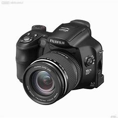

## Welcome to Lixing He's Homepage
<h1>Lixing He(何力行)</h1>
<table border="0">
  <tr>
    <td width="75%">
      
<a href="cv.pdf" download>Full CV download</a>

      
<a href="transcript.pdf" download>Transcript download</a>

      
<b>Undergraduate</b>

      
<b>Automation college of UESTC(University of electronic science and technology of China, Chengdu)</b>

      
<b>helixing99@gmail.com</b>

      
<b>GPA: 90.4/100, Rank: 7/315</b>

      
<b>GPA: 4.0/4.0 at UC Berkeley</b>

      
<b>Toefl: 98, GRE: 328</b>

      
<b>Prospective graduate student</b>

    </td>
    <td width="40%">
           
    </td>
  </tr>
</table>

## News
Our paper "SCSV2: Physics-informed Self-Configuration Sensing through Vision and Vibration Context Modeling" will appear at the Third Workshop of Combining Physical and Data-Driven Knowledge in Ubiquitous Computing (CPD 2020) as part of Ubicomp 2020.<a href="2020_CPD_Lixing.pdf" download>PDF</a>

## Introduction
Hello, my name is Lixing He, an undergraduate student from UESTC major in Automation. I studied at UC Berkeley as exchange student in Spring 2020 and worked with <a href="https://www.pans-lab.com/">Prof. Shijia Pan</a> from UC Merced. Now I am collaborating with <a href="https://www.comp.nus.edu.sg/~junhan/">Prof. Jun Han</a> from National University of Singapore.

## Research interest
My research interest includes signal processing and optimization modelling, and their applications on Cyber-physical system and Security.

# Project

<h2>Well digging signal processing</h2>
<table border="0">
  <tr>
    <td width="75%">
      
<b>Nov 2018-Mar 2019</b

      
<b>UESTC, China</b

      
<b>Building the algorithm on FPGA which classify different signal sources received by a well digger</b

    </td>
    <td width="25%">
           
    </td>
  </tr>
</table>
        

<table border="0">
  <tr>
    <td width="75%">
      <h3>Ham radio</h3>
      
<b>Jan 2020-Oct 2020</b

      
<b>UC Berkeley, USA</b

      
<b>Receive and send ham radio, image&video compression</b

    </td>
    <td width="25%">
           
    </td>
  </tr>
</table>
        
        
<table border="0">
  <tr>
    <td width="75%">
      <h1>Pacman, intro to AI</h1>
      
<b>Jan 2020-May 2020</b

      
<b>UC Berkeley, USA</b

      
<b>Apply multiple AI algorithms in Pacman game</b

    </td>
    <td width="25%">
           
    </td>
  </tr>
</table>

<table border="0">
  <tr>
    <td width="75%">
      <h1>Vibration sensor self-configuration based on sensor fusion</h1>
      
<b>Jan 2020-June 2020</b

      
<b>UC Merced, USA</b

      
<b>Based on physical knowledge, automatically find the location of sensors without human annotation</b

    </td>
    <td width="25%">
           
    </td>
  </tr>
</table>
        
        
<table border="0">
  <tr>
    <td width="75%">
      <h1>Data-driven cross-modalities sensing quality evaluation(vision part)</h1>
      
<b>June 2020-Now</b

      
<b>NUS, Singapore</b

      
<b>Predict application performance with a smaller size of dataset</b

    </td>
    <td width="25%">
           
    </td>
  </tr>
</table>

## Award
1. Great student scholarship of China in UESTC, 2018, 2019
2. Shiqiang company scholarship, 2019
3. Liren scholarship, 2018

